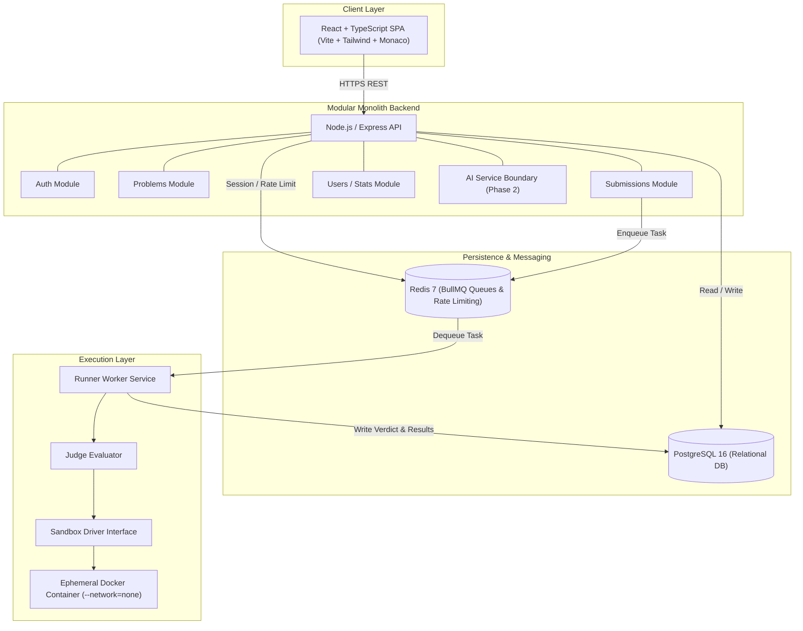
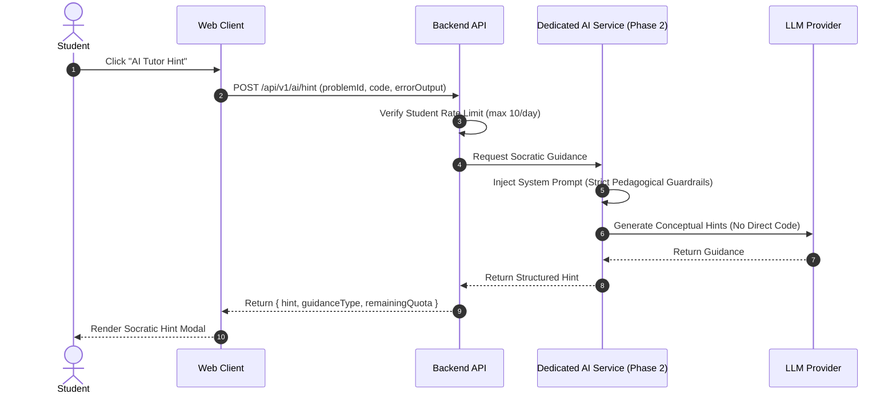

# WeCode System Architecture

## 1. Architectural Philosophy: Modular Monolith

WeCode is intentionally architected as a **Modular Monolith** with an **Asynchronously Decoupled Runner Worker**.

### Why Not Full Microservices in Phase 1?

1. **Operational Complexity**: Microservices introduce distributed tracing, RPC latency, service meshes, distributed transactions, and multi-repo deployment overhead that slow down iteration and create unnecessary operational failure modes.
2. **Data Consistency**: Problem management, test case verification, user records, and submission accounting inherently belong in a strongly consistent relational domain.
3. **Simplicity & Scale**: A clean modular monolith can easily handle tens of thousands of college students on modest infrastructure (e.g. 2-4 vCPUs and 8GB RAM for the API and database).

### The Decoupled Worker Exception

The **Code Runner Worker** is explicitly isolated from the API server. Untrusted user-submitted code must **never** execute inside the Node.js API process. Decoupling code execution via Redis/BullMQ ensures that:

- Heavy compilation and CPU-bound container runs cannot starve the API of event-loop cycles.
- Runners can scale horizontally and independently across worker nodes.
- High submission surges (e.g. during contest deadlines) queue up safely without dropping HTTP connections.

---

## 2. High-Level Component Topology



---

## 3. End-to-End Data Flows

### Flow A: Login

1. **Client Submission**: Client sends `POST /api/v1/auth/login` with `{ email, password }`.
2. **Rate Limiting**: Express middleware validates IP request limits in Redis.
3. **User Lookup**: Backend queries PostgreSQL `users` table by normalized lowercase email.
4. **Credential Verification**: Password hash is verified using `bcrypt.compare` with constant-time protection.
5. **Token Generation**: Generates signed HMAC-SHA256 JWT access token (15m expiration) and refresh token (7d expiration).
6. **Cookie & Response**: Access token is attached to an `HttpOnly`, `SameSite=Lax`, `Secure` cookie and returned in the JSON payload envelope.

### Flow B: Opening a Problem

1. **Client Request**: Client navigates to `/problems/:slug` and triggers `GET /api/v1/problems/:slug`.
2. **Public Data Retrieval**: Backend fetches problem details, difficulty, limits, and tags from PostgreSQL.
3. **Strict Test Case Isolation**: Query filters explicitly:
   ```sql
   SELECT * FROM test_cases WHERE problem_id = :id AND is_sample = true ORDER BY order_index ASC;
   ```
   **Security Guarantee**: Hidden test cases (`is_sample = false`) are never selected, serialized, or transferred to the client.
4. **User Progress Context**: If an auth cookie is present, backend checks for previous accepted submissions by the student to display completion status.
5. **Rendering**: Client populates problem statement markdown and initializes Monaco editor with language template.

### Flow C: Run Code (Interactive Sample or Custom Input)

1. **Action**: Student clicks "Run Code" in browser with chosen language and optional custom input.
2. **API Endpoint**: Client sends `POST /api/v1/problems/:slug/run` with `{ language, code, customInput? }`.
3. **Throttling**: Enforces interactive run rate limiter (e.g. max 10 runs per minute per user).
4. **Task Dispatch**: API builds a transient `RunnerTask` with `isSubmission = false` and pushes it to BullMQ `wecode-runs` queue.
5. **Worker Execution**:
   - Worker compiles C++ source via `g++ -O3 -std=c++17` in sandbox workspace.
   - Executes binary against user custom input (or first sample test case).
   - Captures stdout, stderr, execution time, and memory usage.
6. **Direct Result**: The worker fulfills the BullMQ job; the API waiting on job completion returns `{ stdout, stderr, executionTimeMs, memoryKb, verdict }` directly to the client. **No submission row is created in the database.**

### Flow D: Submit Code (Asynchronous Judging)

1. **Action**: Student clicks "Submit".
2. **API Endpoint**: Client sends `POST /api/v1/problems/:slug/submit` with `{ language, code }`.
3. **Database Insertion**: Backend opens transaction and creates `submissions` record:
   - `status = PENDING`
   - `verdict = QUEUED`
4. **Queue Dispatch**: Backend pushes `RunnerTask` to BullMQ `wecode-submissions` queue containing problem limits and all test cases (both sample and hidden).
5. **Immediate Acknowledgment**: API returns `202 Accepted` with `{ submissionId, status: "PENDING" }`.
6. **Worker Processing**:
   - Worker picks up job, updates submission status to `RUNNING` in PostgreSQL.
   - Compiles code inside isolated environment. If compilation fails, records `COMPILATION_ERROR` with compiler stderr and halts.
   - Iterates through test cases sequentially.
   - Runs code in ephemeral container with `--network none`, `--memory 256m`, `--cpus 1.0`, `--pids-limit 64`, `--read-only`.
   - Compares stdout against `expectedOutput` using `JudgeComparator.compare()`.
   - On first failure (WA, TLE, MLE, RE), sets aggregate verdict and short-circuits.
7. **Database Finalization**: In a single database transaction, worker writes all individual test results to `submission_results` and updates `submissions` row with terminal verdict, peak memory, and max runtime.
8. **Client Polling**: Client polls `GET /api/v1/submissions/:id` until `status === 'COMPLETED'`. Hidden test case inputs and expected outputs are strictly redacted in the API response.

### Flow E: AI Hint (Phase 2 Architectural Boundary)



### Flow F: Viewing Submission History

1. **Client Request**: Student opens "Submissions" tab (`GET /api/v1/submissions`).
2. **Query Filtering**: Backend selects submissions where `user_id = :currentUserId` ordered by `created_at DESC` with pagination (`page`, `limit`).
3. **Detail View**: Student clicks on a specific submission (`GET /api/v1/submissions/:id`).
4. **Privacy & Redaction**:
   - If user is owner or admin, submission code is returned.
   - For `submission_results`:
     - If `test_case.is_sample == true`: reveals `inputData`, `expectedOutput`, `stdout`, `stderr`.
     - If `test_case.is_sample == false`: redacts `inputData`, `expectedOutput`, `stdout`, `stderr`, returning only the verdict badge, runtime, and memory.
