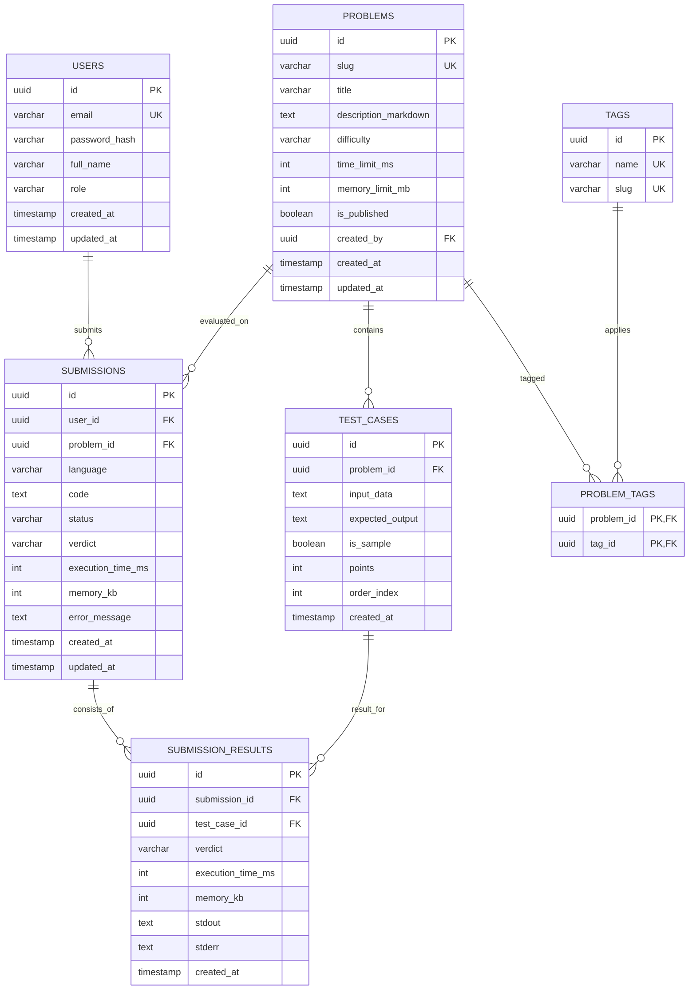

# WeCode Database Schema Specification

This document details the PostgreSQL relational schema designed for **WeCode**. The schema balances relational integrity, query performance for thousands of concurrent students, and strict test case security.

---

## 1. Entity Relationship Overview

---

## 2. Table Specifications & Rationale

### 2.1 `users`

Stores user identities, hashed credentials, and role assignments.

| Column          | Type           | Constraints                   | Description                                    |
| :-------------- | :------------- | :---------------------------- | :--------------------------------------------- |
| `id`            | `UUID`         | `PRIMARY KEY`                 | Globally unique user identifier                |
| `email`         | `VARCHAR(255)` | `UNIQUE, NOT NULL`            | Student or faculty institutional email         |
| `password_hash` | `VARCHAR(255)` | `NOT NULL`                    | Argon2id / bcrypt salted password hash         |
| `full_name`     | `VARCHAR(100)` | `NOT NULL`                    | Student's full name for roster & leaderboard   |
| `role`          | `VARCHAR(20)`  | `NOT NULL, DEFAULT 'STUDENT'` | Access level: `STUDENT`, `ADMIN`, or `FACULTY` |
| `created_at`    | `TIMESTAMPTZ`  | `NOT NULL, DEFAULT NOW()`     | Account registration timestamp                 |
| `updated_at`    | `TIMESTAMPTZ`  | `NOT NULL, DEFAULT NOW()`     | Last account update timestamp                  |

**Indexes:**

- `UNIQUE INDEX idx_users_email ON users(email)` for $O(1)$ login lookups.

---

### 2.2 `problems`

Defines coding challenges, problem statements, and runtime/memory bounds.

| Column                 | Type           | Constraints                | Description                                     |
| :--------------------- | :------------- | :------------------------- | :---------------------------------------------- |
| `id`                   | `UUID`         | `PRIMARY KEY`              | Problem identifier                              |
| `slug`                 | `VARCHAR(100)` | `UNIQUE, NOT NULL`         | URL-friendly unique identifier (e.g. `two-sum`) |
| `title`                | `VARCHAR(200)` | `NOT NULL`                 | Human-readable problem title                    |
| `description_markdown` | `TEXT`         | `NOT NULL`                 | Full problem description, constraints, examples |
| `difficulty`           | `VARCHAR(20)`  | `NOT NULL, DEFAULT 'EASY'` | `EASY`, `MEDIUM`, or `HARD`                     |
| `time_limit_ms`        | `INT`          | `NOT NULL, DEFAULT 2000`   | Max execution time per test case (ms)           |
| `memory_limit_mb`      | `INT`          | `NOT NULL, DEFAULT 256`    | Max RAM allocated to sandbox (MB)               |
| `is_published`         | `BOOLEAN`      | `NOT NULL, DEFAULT FALSE`  | Whether students can view and solve the problem |
| `created_by`           | `UUID`         | `REFERENCES users(id)`     | Author user ID                                  |
| `created_at`           | `TIMESTAMPTZ`  | `NOT NULL, DEFAULT NOW()`  | Creation timestamp                              |
| `updated_at`           | `TIMESTAMPTZ`  | `NOT NULL, DEFAULT NOW()`  | Last modified timestamp                         |

**Indexes:**

- `INDEX idx_problems_published_difficulty ON problems(is_published, difficulty)` to optimize filtered student catalog browsing.

---

### 2.3 `tags` & `problem_tags`

Allows algorithmic categorization (e.g. `dynamic-programming`, `graphs`, `arrays`) with a many-to-many relationship.

**`tags` Table:**

- `id` (`UUID PK`), `name` (`VARCHAR(50) UNIQUE`), `slug` (`VARCHAR(50) UNIQUE`).

**`problem_tags` Table:**

- `problem_id` (`UUID REFERENCES problems(id) ON DELETE CASCADE`)
- `tag_id` (`UUID REFERENCES tags(id) ON DELETE CASCADE`)
- `PRIMARY KEY (problem_id, tag_id)` prevents duplicate tag assignments.

---

### 2.4 `test_cases`

Holds both public sample test cases and confidential hidden test cases.

| Column            | Type          | Constraints                                 | Description                                                      |
| :---------------- | :------------ | :------------------------------------------ | :--------------------------------------------------------------- |
| `id`              | `UUID`        | `PRIMARY KEY`                               | Test case identifier                                             |
| `problem_id`      | `UUID`        | `REFERENCES problems(id) ON DELETE CASCADE` | Associated problem                                               |
| `input_data`      | `TEXT`        | `NOT NULL`                                  | Standard input fed into the runner                               |
| `expected_output` | `TEXT`        | `NOT NULL`                                  | Expected standard output for comparison                          |
| `is_sample`       | `BOOLEAN`     | `NOT NULL, DEFAULT FALSE`                   | Flag: `true` for public examples, `false` for hidden judge tests |
| `points`          | `INT`         | `NOT NULL, DEFAULT 10`                      | Score weight for partial-credit evaluation                       |
| `order_index`     | `INT`         | `NOT NULL, DEFAULT 0`                       | Display and execution sequence order                             |
| `created_at`      | `TIMESTAMPTZ` | `NOT NULL, DEFAULT NOW()`                   | Creation timestamp                                               |

**Indexes:**

- `INDEX idx_test_cases_problem_sample ON test_cases(problem_id, is_sample)` ensures that student queries selecting sample cases (`WHERE is_sample = true`) never scan hidden rows.

---

### 2.5 `submissions`

Tracks the overarching state and final verdict of every student attempt.

| Column              | Type          | Constraints                                  | Description                                               |
| :------------------ | :------------ | :------------------------------------------- | :-------------------------------------------------------- |
| `id`                | `UUID`        | `PRIMARY KEY`                                | Unique submission identifier                              |
| `user_id`           | `UUID`        | `REFERENCES users(id) ON DELETE RESTRICT`    | Student author                                            |
| `problem_id`        | `UUID`        | `REFERENCES problems(id) ON DELETE RESTRICT` | Target problem                                            |
| `language`          | `VARCHAR(20)` | `NOT NULL, DEFAULT 'CPP'`                    | Programming language (`CPP`, `PYTHON`, `JAVA`)            |
| `code`              | `TEXT`        | `NOT NULL`                                   | Submitted source code                                     |
| `status`            | `VARCHAR(20)` | `NOT NULL, DEFAULT 'PENDING'`                | Lifecycle: `PENDING`, `COMPILING`, `RUNNING`, `COMPLETED` |
| `verdict`           | `VARCHAR(30)` | `NOT NULL, DEFAULT 'QUEUED'`                 | Aggregate result verdict                                  |
| `execution_time_ms` | `INT`         | `NULLABLE`                                   | Peak runtime across test cases                            |
| `memory_kb`         | `INT`         | `NULLABLE`                                   | Peak memory consumed                                      |
| `error_message`     | `TEXT`        | `NULLABLE`                                   | Compilation error or system failure details               |
| `created_at`        | `TIMESTAMPTZ` | `NOT NULL, DEFAULT NOW()`                    | Submission timestamp                                      |
| `updated_at`        | `TIMESTAMPTZ` | `NOT NULL, DEFAULT NOW()`                    | Last update timestamp                                     |

**Indexes:**

- `INDEX idx_submissions_user_problem_created ON submissions(user_id, problem_id, created_at DESC)` powers the student's submission history tab.
- `INDEX idx_submissions_problem_verdict ON submissions(problem_id, verdict)` accelerates problem acceptance statistics calculations.

---

### 2.6 `submission_results`

Stores the deterministic evaluation outcome for each individual test case.

| Column              | Type          | Constraints                                    | Description                                 |
| :------------------ | :------------ | :--------------------------------------------- | :------------------------------------------ |
| `id`                | `UUID`        | `PRIMARY KEY`                                  | Result identifier                           |
| `submission_id`     | `UUID`        | `REFERENCES submissions(id) ON DELETE CASCADE` | Associated submission                       |
| `test_case_id`      | `UUID`        | `REFERENCES test_cases(id) ON DELETE CASCADE`  | Tested test case                            |
| `verdict`           | `VARCHAR(30)` | `NOT NULL`                                     | Verdict for this specific test case         |
| `execution_time_ms` | `INT`         | `NOT NULL`                                     | Test case runtime                           |
| `memory_kb`         | `INT`         | `NOT NULL`                                     | Test case memory consumption                |
| `stdout`            | `TEXT`        | `NULLABLE`                                     | Process standard output (truncated at 64KB) |
| `stderr`            | `TEXT`        | `NULLABLE`                                     | Process standard error                      |
| `created_at`        | `TIMESTAMPTZ` | `NOT NULL, DEFAULT NOW()`                      | Timestamp                                   |

**Constraints:**

- `UNIQUE (submission_id, test_case_id)` ensures idempotency and guarantees a test case cannot be judged twice for the same submission.
