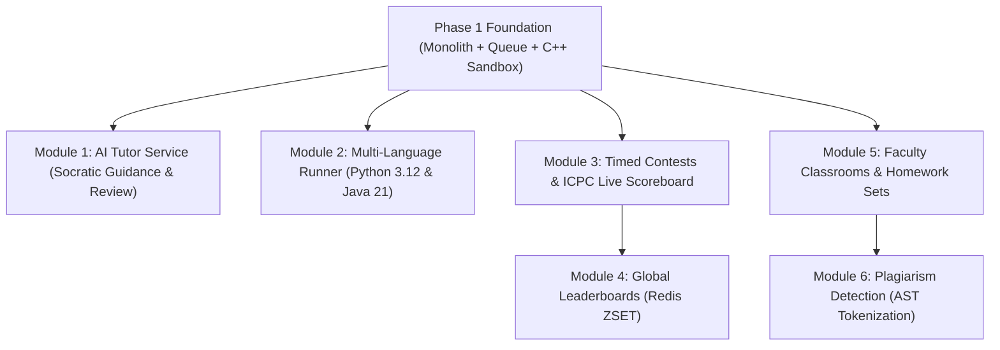

# WeCode Phase 2 Implementation Roadmap

With the Phase 1 architectural foundation, database schema, decoupled worker queue, and Monaco frontend established, **Phase 2** expands WeCode into an intelligent, community-driven competitive and classroom coding environment.

---

## 1. Phase 2 Key Modules & Deliverables

---

## 2. Module Breakdown & Architecture

### 2.1 Module 1: Dedicated AI Tutor Service

- **Objective**: Provide intelligent, pedagogical hints and code reviews without spoiling solutions.
- **Architectural Boundary**:
  - Implement a dedicated AI service (`ai-service/`) or isolated backend module calling LLM providers (e.g. Google Gemini API) via structured JSON function calling.
  - Socratic system prompt design: strictly forbids outputting full code solutions; directs students to algorithmic edge cases, time complexity analysis, or standard library documentation.
  - Daily token quotas per student enforced via Redis counters.
  - Logging of AI interactions to analyze student struggle points for faculty insights.

### 2.2 Module 2: Multi-Language Runner Expansion

- **Objective**: Expand beyond C++ to support Python 3.12 and Java 21.
- **Implementation**:
  - Create `runner/docker/python/Dockerfile` and `runner/docker/java/Dockerfile`.
  - Python security: disable `os`, `sys`, `subprocess` via custom seccomp profile or restricted python runtime; configure appropriate 2x–3x time limit multipliers for interpreted languages.
  - Java: optimize JVM memory allocation (`-Xmx128m -XX:+UseSerialGC`) to fit inside strict cgroups limits.

### 2.3 Module 3: Contests & ICPC-Style Scoring

- **Objective**: Allow admins to host timed programming competitions.
- **Schema Additions**:
  - `contests` (id, title, start_time, end_time, is_frozen).
  - `contest_problems` (contest_id, problem_id, point_value, order_index).
  - `contest_participants` (contest_id, user_id, score, penalty_minutes).
- **Evaluation**:
  - Score calculations follow standard ICPC rules (score = solved count, penalty = submission time + 20 minutes per incorrect attempt before acceptance).
  - Scoreboard freezing: hides standings 1 hour before contest completion to build suspense.

### 2.4 Module 4: High-Performance Leaderboards

- **Objective**: Real-time college ranking without database query bottlenecks.
- **Implementation**:
  - Use Redis Sorted Sets (`ZSET`) keyed by `leaderboard:global` and `leaderboard:contest:{id}`.
  - Updating scores is an $O(\log N)$ operation via `ZINCRBY` or `ZADD`.
  - Fetching top 50 ranks is an instant $O(\log N + M)$ query using `ZREVRANGEBYSCORE`.

### 2.5 Module 5: Classrooms & Faculty Portal

- **Objective**: Support course instructors in running lab assignments.
- **Features**:
  - Faculty dashboard to create course sections (e.g. "CS101 - Fall 2026").
  - Problem set assignments with hard deadlines and grace periods.
  - Student progress analytics: submission distribution, pass rate per problem, common error taxonomy.

### 2.6 Module 6: Plagiarism Detection Foundation

- **Objective**: Detect code copying among student submissions.
- **Technique**:
  - Tokenization of student AST (stripping comments, variable names, whitespace).
  - Winnowing fingerprinting algorithm comparing k-gram hashes against all submissions for the assignment.
  - Similarity percentage matrix visualizer for faculty review.

---

## 3. Milestones & Timeline

| Sprint       | Focus Area              | Deliverables                                                               |
| :----------- | :---------------------- | :------------------------------------------------------------------------- |
| **Sprint 1** | Python & Java Sandboxes | Multi-language Dockerfiles, runner driver extensions, language benchmarks. |
| **Sprint 2** | AI Tutor Module         | Gemini API integration, Socratic prompt engineering, quota tracking.       |
| **Sprint 3** | Contest Engine          | Contest scheduling, contest submission flow, freeze mechanism.             |
| **Sprint 4** | Redis Leaderboards      | Real-time ZSET ranking, contest scoreboard UI, WebSocket live updates.     |
| **Sprint 5** | Classrooms & Analytics  | Faculty role features, cohort rosters, automated homework grading.         |
| **Sprint 6** | Plagiarism Detection    | AST tokenizer, similarity scoring pipeline, faculty audit dashboard.       |
